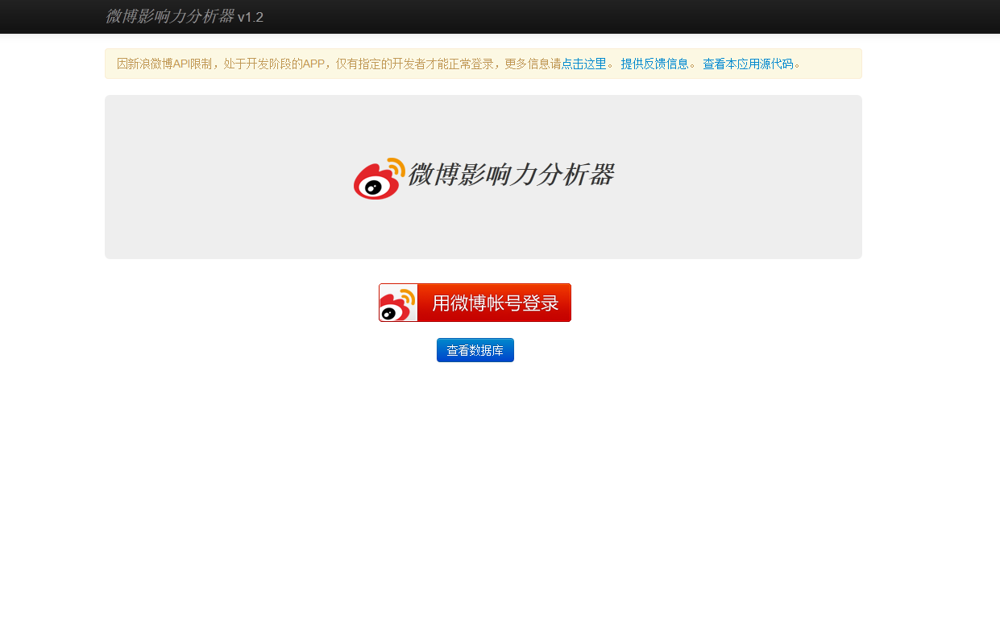
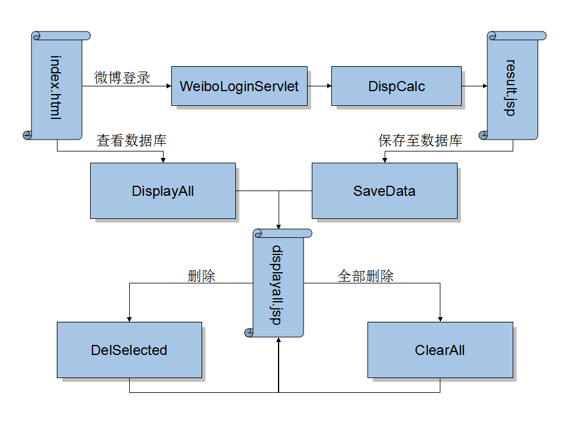

# 微博影响力分析器 #

## 程序概况 ##

这是新浪微博版的 [`bluemix-java-sample-twitter-influence-app`](https://github.com/ibmjstart/bluemix-java-sample-twitter-influence-app/ "bluemix-java-sample-twitter-influence-app") ，使用Cloudant JSON-DB作为后台数据库。

## License ##

Licensed under the Apache License, Version 2.0 (the "License"); you may not use this file except in compliance with the License. You may obtain a copy of the License at

     http://www.apache.org/licenses/LICENSE-2.0

Unless required by applicable law or agreed to in writing, software distributed under the License is distributed on an "AS IS" BASIS, WITHOUT WARRANTIES OR CONDITIONS OF ANY KIND, either express or implied. See the License for the specific language governing permissions and limitations under the License.

## 使用方法 ##

* [《 基于Bluemix快速构建部署一款Java小程序——微博影响力分析器》](http://blog.csdn.net/dewafer/article/details/42125509)
* [`pushing-the-app-using-eclipse`](https://github.com/ibmjstart/bluemix-java-sample-twitter-influence-app#pushing-the-app-using-eclipse)（英文）。

### * 源代码下载 ###

您可以使用下方的链接下载zip包或者直接克隆本代码仓库。

| Download Zip | [`https://github.com/dewafer/weibo-influence-analyzer/archive/master.zip`](https://github.com/dewafer/weibo-influence-analyzer/archive/master.zip) |
|-----------|---------------------------------------------------------------------|
| Git Clone:| `git clone https://github.com/dewafer/weibo-influence-analyzer/archive/master.zip` |

### 注意 ###

* 发布前请先配置环境变量：

|       环境变量名       |     对应值     |
|----------------------|---------------|
|    WEIB_CLIENT_ID    | 微博App Client |
| WEIBO_CLIENT_SERCRET | 微博App Secret |
|     BAIDU_MAP_AK     |   百度地图AK    |

## 变更履历 ##

V1.2

* 中文化了程序界面。

* 使用百度地图替换了Google地图。

* 将Google的jQuery CDN替换为本地jQuery引用。

* 修改了微博API配置读取方式，从读取config.properties改为读取环境变量（System.getenv()）。

* 增加了自动创建数据库功能（wangyq.cloudant.api.SimpleCloudantDBUtil#createDatabaseIfNotExists），首次链接时自动检测，如无数据库则自动创建。

V1.1

* Replaced twitter4j with weibo4j-oauth2.

* Added a WeiboLoginServlet for login.

* Added setCharacterEncoding in every servlet for better CN compatibility.

* Removed klout sine we don't have the same service for Weibo.

* Replaced search input with login button, so users can only analyzer oneself. May restore the search function later. 

* (NEW) Replaced Mongodb with Cloudant JSON-DB using Jackson and Apache HttpComponent. Review `wangyq.cloudant.api.SimpleCloudantDBUtil` and `wangyq.cloudant.api.HttpActions` for more details.

## 图片预览 ##

