# weibo_influence_analyzer_cloudant #

## Overview of app ##

This is the Sina Weibo verions of [`bluemix-java-sample-twitter-influence-app`](https://github.com/ibmjstart/bluemix-java-sample-twitter-influence-app/ "bluemix-java-sample-twitter-influence-app") using Cloudant JSON-DB as its database backbone.

## License ##

Licensed under the Apache License, Version 2.0 (the "License"); you may not use this file except in compliance with the License. You may obtain a copy of the License at

     http://www.apache.org/licenses/LICENSE-2.0

Unless required by applicable law or agreed to in writing, software distributed under the License is distributed on an "AS IS" BASIS, WITHOUT WARRANTIES OR CONDITIONS OF ANY KIND, either express or implied. See the License for the specific language governing permissions and limitations under the License.

## Usage ##

See [`pushing-the-app-using-eclipse`](https://github.com/ibmjstart/bluemix-java-sample-twitter-influence-app#pushing-the-app-using-eclipse).

### * Download Source ###

The source for this app is at GitHub and DevOps, you can either download the zip file or clone the repository from the command line, or review the source just using your browser with DevOps.

| Download Zip | [`https://github.com/dewafer/weibo_influence_analyzer/archive/master.zip`](https://github.com/dewafer/weibo_influence_analyzer/archive/master.zip) |
|-----------|---------------------------------------------------------------------|
| Git Clone:| `git clone https://github.com/dewafer/weibo_influence_analyzer.git` |
| DevOps:   | [`https://hub.jazz.net/project/dewafer/weibo_influence_analyzer/code`](https://hub.jazz.net/project/dewafer/weibo_influence_analyzer/code)|

## Notice ##

* Due to the restrictions of Weibo APIs, only the owner and the testers of the app have access to the APIs, so if you want to try my deployment on the Bluemix, please tell me your Weibo nickname and I'll put you into the tester name list.(or [apply for test and get involved in here](http://wia-req.ng.bluemix.net/) (Chinese))

* If you want to deploy your own app, please apply Weibo API first and fill out `/weibo_influence_analyzer/src/config.properties` with your app keys before deploy. 

## Articles ##

* [Details on development of Weibo Influencer Analyzer.](https://w3-connections.ibm.com/blogs/wangyq/entry/weibo_influence_analyzer%E5%81%9A%E6%88%90%E6%89%8B%E8%AE%B0?lang=zh)(Chinese)

## Change log ##

* Replaced twitter4j with weibo4j-oauth2.

* Added a WeiboLoginServlet for login.

* Added setCharacterEncoding in every servlet for better CN compatibility.

* Removed klout sine we don't have the same service for Weibo.

* Replaced search input with login button, so users can only analyzer oneself. May restore the search function later. 

* (NEW) Replaced Mongodb with Cloudant JSON-DB using Jackson and Apache HttpComponent. Review `wangyq.cloudant.api.SimpleCloudantDBUtil` and `wangyq.cloudant.api.HttpActions` for more details.

## Screenshots ##

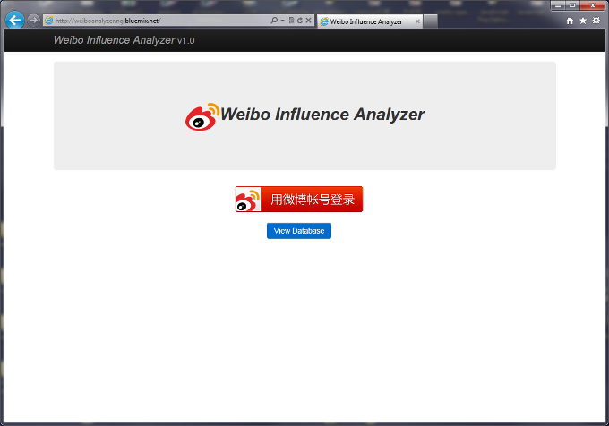

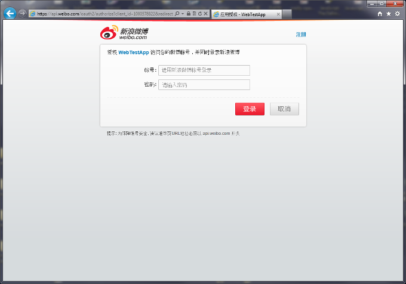

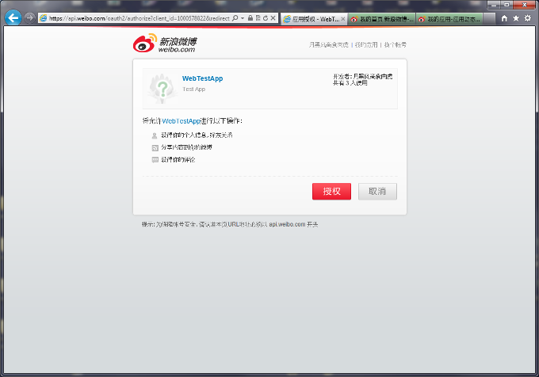

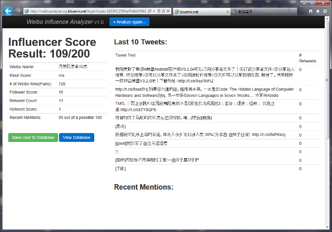

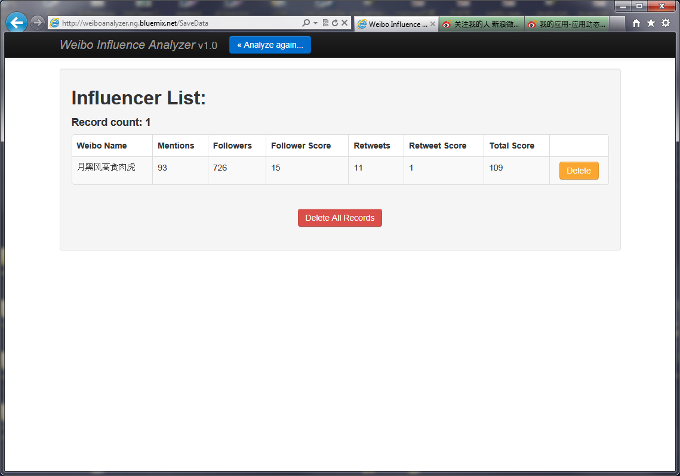

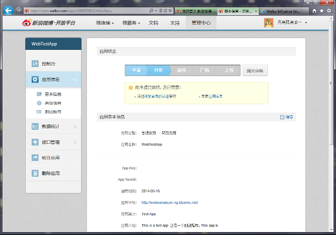

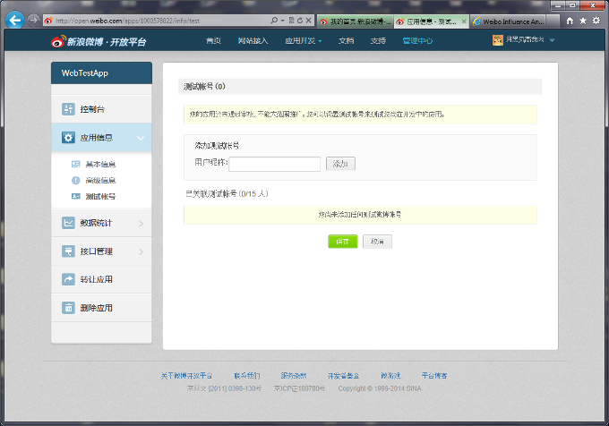

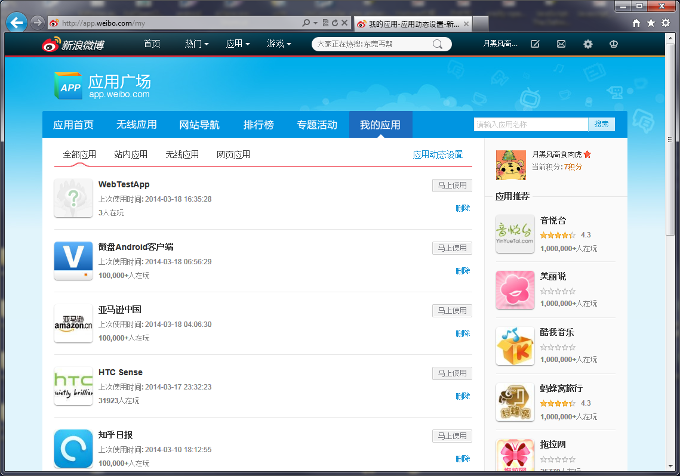

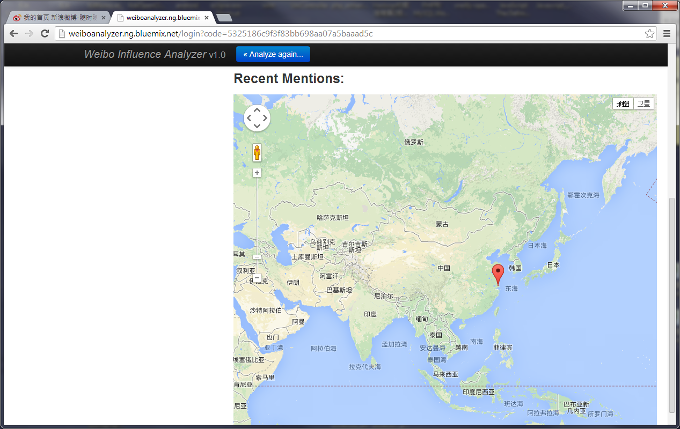

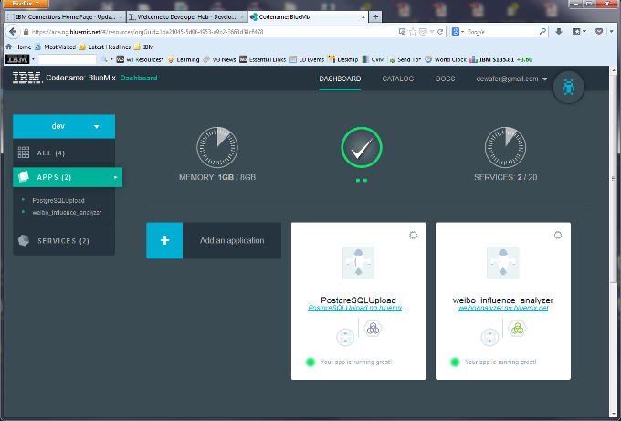

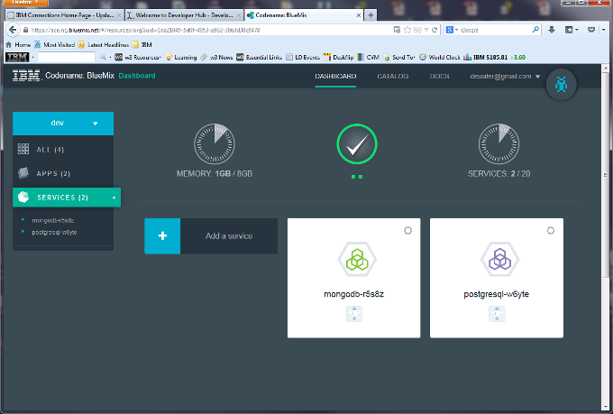
